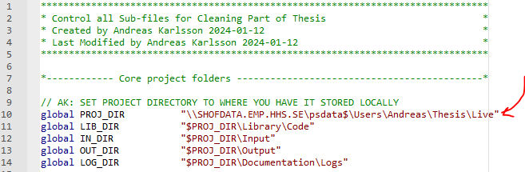
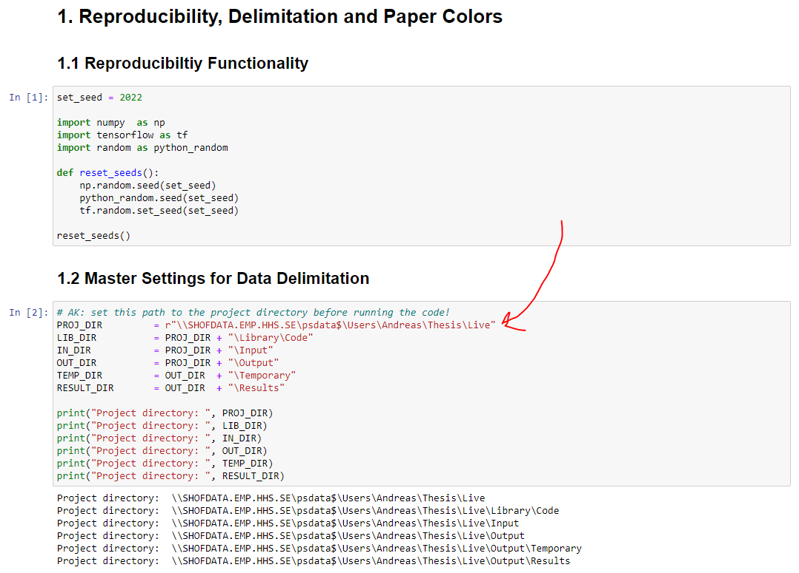

# Empirical Pricing Kernel Models and the Permanent-Transitory Decomposition via Machine Learning

**Title**: Double Degree Thesis for M.A. in Banking and Finance (MBF) and MSc. in Finance (MFIN)  
**Institutions**: University of St. Gallen (HSG) and Stockholm School of Economics (SSE)  
**Author**:              Andreas Karlsson  
**Supervisor (SSE)**:    Prof. Gualtiero Azzalini  
**Supervisor (HSG)**:    Prof. David Preinerstorfer  
**Co-supervisor (HSG)**: Dr. Zeno Adams  

## Abstract [TBU]

Description of replication files for the thesis "Empirical Pricing Kernel Models and the Permanent-Transitory Decomposition via Machine Learning".

[Write intro]

## 1. Notebook Outline [TBU]

Note that the notebook is separated into 11 sections:

1. [Model Specification]
2. [Preliminaries]
3. [Data Importation]
4. [Data Handling]
5. [Figure 1]
6. [Finalize Features and Outcomes]
7. [Figure 2]
8. [Predictive OLS Model]
9. [VAR(1) Model]
10. [Variance Decomposition]
11. [Appendix Plots]

## 2. Preliminaries

This section describes the technical specifications used in the thesis. To ensure full replication, please ensure that the same versions of imported packages are forced to be specified to exactly what is stated here as the results may vary on package version and the compatibility across packages.

#### 2.1 Operating System

- Operating system: Windows 10.0.20348
- CPU: Intel(R) Xeon(R) Gold 6132 CPU @ 2.60GHz

#### 2.2 STATA 

The following specifications (versions) of STATA and STATA packages were used for this project:
- STATA/MP (18.0)
- estout (3.31)
- tab2xl (1.0.5)
- reghdfe (6.12.3)
- ftools (2.49.1)
- sxpose (1.0.0)
- listtab (Nov 4th, 2012)
- texsave (1.6.1)
- mdesc (2.1)
- winsor (1.3.0)
- winsor2 (1.1)
- carryforward (4.5)
- rangestat (1.1.1)

*NOTE: if a package is not installed on the computer, you need to install the module first*. 

#### 2.3 PYTHON

The following specifications (version) were used for this project:

- Python (3.11.5)
- IDE: Jupyter Notebook (6.5.4)
- Pandas (2.0.3)
- Numpy (1.24.3)
- statsmodels (0.14.0)
- graphviz (0.20.1)
- matplotlib (3.7.2)
- scipy (1.11.1)
- sklearn (1.3.0)
- linearmodels (5.3)
- IPython version (8.15.0)
- simple_colors (0.1.5)
- import_ipynb (0.1.4)
- Tensorflow & Keras (2.14.0)
- seaborn (0.12.2)
- [need stuff for the plot_model]

*NOTE: if a package is not installed on the computer, you need to install the module first*. 

## 3. Overview of Input Files [TBU]

#### 3.1 Raw Input Data [TBU]

##### 3.1.1 Firm Accounting Data [TBU]

##### 3.1.2 Firm Market Data [TBU]

##### 3.1.3 Exchange Rates [TBU]

##### 3.1.4 Interest Rates [TBU]

##### 3.1.5 Other Data [TBU]
- Time-Series Death

[**brief description**]

#### 3.2 Cleaned Input Data [TBU]

##### 3.2.1 Cleaned Firm Characterstics [TBU]

##### 3.2.2 Cleaned Return Data [TBU]

##### 3.2.3 Cleaned Mask [TBU]

##### 3.2.4 Bond Data [TBU]

[**brief description about importing with Python**]

## 4. Full Paper Replication [TBU]

### 4.1 STATA Data Cleaning Replication

The first step of the replication is to change the path in the STATA master .do file ("Master.do") for the STATA code, see image below. Change this path to the directory where the entire project is stored. All other folder paths are set relative to this path so make sure it's correctly specified. The master file is located in the "Library" folder and all other subfolders are located in the "Library/Code" folder. 

After having completed this step, the user can replicate the entire data cleaning procedure by running the master file. Running the master file ensures all sub-programs are executed in the correct and intended order. This process takes the raw input files stored in the "Input" folder and stores cleaned datasets in the "Output" folder (more specifically, the "Output/Temporary" folder). These output files are to be used for machine learning estimation using Python at the next stage. Because of this, the user must ensure full write permissions locally. In detail, this STATA data cleaning process follows 3 overall steps:

#### 4.1.1 Cleaning Input Data

All programs located in the "FCC1_Company_List" folder are related to the importation and cleaning of the underlying firm-level accounting and market data.

- **FCC1_0**: Runs all .do files in the folder "FCC1_Company_List"
- **FCC1_1**: Imports additional Refinitiv Eikon firm data that was omitted by the author in the first data downloading process
- **FCC1_2**: Imports and cleans FX variables
- **FCC1_3**: Imports and cleans risk-free rates
- **FCC1_4**: Imports and cleans gross profit for all firms
- **FCC1_5**: Imports and cleans dividend yield for all firms
- **FCC1_6**: Imports and cleans accounting and market data for delisted firms
- **FCC1_7**: Imports and cleans shareholder's equity for all firms
- **FCC1_8**: Consolidates all firm-level accounting data for all firms
- **FCC1_9**: Consolidates all firm-level accounting and market data for all firms

*Detailed descriptions of the code is left to in-program comments*

#### 4.1.2 Creating Firm Characteristics

All programs located in the "FCC2_Create_Firm_Chars" folder are related to building the information set of *firm* characteristics $I_{t,i}$ and the macroeconomic information set relating to the *firm* characteristics $I_t$

- **FCC2_0**: Runs all .do files in the folder "FCC2_Create_Firm_Chars"
- **FCC2_1**: Creates the auxiliary metrics from firm-level data required for constructing the complete firm characteristics later
- **FCC2_2**: Creates 41 of 46 total firm characteristics, masked and unmasked
- **FCC2_3**: Creates final 5 firm characteristics, masked and unmasked
- **FCC2_4**: Combines firm characteristic dataset and performs quantile-normalization (QN) of firm characteristics
- **FCC2_5**: Creates macroeconomic information set by aggregating firm characteristics and performing stationarity transformations

*Detailed descriptions of the code is left to in-program comments*

#### 4.1.3 Cleaning and Creating Bond Characteristics

All programs located in the "FCC3_Bond_Chars" folder are related to building the information set of *bond* characteristics $I_{t,b}^{(b)}$ and the macroeconomic information set relating to the *bond* characteristics $I_t^{(b)}$

- **FCC3_0**: Runs all .do files in the folder "FCC3_Bond_Chars"
- **FCC3_1**: Imports and initial cleans underlying bond time series data
- **FCC3_2**: Further cleaning of bond time series data
- **FCC3_3**: Adjust bond data for currency differences
- **FCC3_4**: Create bond characteristics
- **FCC3_5**: Combines bond characteristics and lags by 9 weeks
- **FCC3_6**: Performs quantile-normalization (QN) of bond characteristics
- **FCC3_7**: Creates macroeconomic information set by aggregating bond characteristics and performing stationarity transformations

*Detailed descriptions of the code is left to in-program comments*

### 4.2 Python Machine Learning Replication

The Python code is stored in a notebook format (.ipynb) for easier user understanding. In particular, text and LaTeX code is rendered within the notebook to give detailed descriptions of what goes on within each section of the code. I reference to these specific descriptions for users looking for in depth explanations of blocks of code. Furthermore, there are also within-code comments for code-line specific explanations. The code is combined into a single file, and is to be run from top to bottom. Naturally, this has to be done *after* the STATA cleaning procedure has been completed as the Python code refers to outputs from the data cleaning procedure. After the user has ensured that the machine is compatible with all the package-specifications in section 2.3, the user needs to again set the project directory (PROJ_DIR) in the Python code. This needs to be the same project directory as specified previously for the STATA master file:

The code has [**insert number of sections in python code here**] sections of code in total, each performing different tasks.

[**step-by-step description**]

To replicate the tables and figures used in the assignment. The aforementioned modules needs to be used. Furthermore, the two underlying data files: 

- dataset.xls
- dividend_data.xls

needs to be in *the same folder* as the jupyter notebook. In the first cell in *section 3*, specify the current working directory (*cwd*) where all replication files (including the notebook) are located. The *dataset.xls* contains the trading day prices of the FEXD dividend futures on the Eurostoxx 50 DVP. The file *dividend_data.xls* contains the Eurostoxx 50 DVP. 

To run the code as intended, please make sure that all the modules in *section 2* are installed before importing them. Ideally, use the same versions of each module as we did. Furthermore, pay attention to *section 3: Data Importation*. In order to import the data as intended, find the working directory of all replication files and change the directory to that folder in the following line:

Do *not* change the filename or sheet-name variables in the cell.

To replicate all figures and tables used in the paper, take note of the only cell in *section 1: Model Specification*. It is in this cell where you can change between the model specifications used. As outlined in the paper, we consider 3 models: 

1. BHK: $e_t^{(2)}$ and $e_t^{(5)}$
2. SML: $e_t^{(1)}$, $e_t^{(5)}$ and $e_t^{(10)}$
3. S2: $e_t^{(1)}$ and $e_t^{(2)}$

To implement the BHK model, simply uncomment the 'VARS' variable where we indicate that the BHK specification is, and then run every cell in the notebook from start to end. Note that it may take some seconds for some of the cell to execute, depending on GPU.

Similarly, to implement the SML model, *reset the kernel* and simply uncomment the 'VARS' variable where we indicate that the SML specification is and run every cell again.

Finally, to implement the S2 model, *reset the kernel* and simply uncomment the 'VARS' variable where we indicate that the S2 specification is and run every cell again.

## 5. Where to find outputs included in the paper? [TBU]

Simply, for Figure 1, Figure 2, and the Appendix figures (Figure 5 and Figure 6), look at the output in sections 5, 7, and 11, respectively.

In the only cell in *section 8: Predictive OLS Model*, the OLS output in Table 2 for the active model is outputted, as well as its respective panel that is in Figure 3. Therefore, to get every number in the OLS portion of Table 2, you need to run the notebook for each model and take note of the output for each active model. Similarly, to get every panel of Figure 3, you need to save the figure output for each active model.

The rest of Table 2, the part that pertains to the VAR(1) model is contained under the following section, *section 9: VAR(1) Model*. In the first cell in that section you will find the output to the VAR(1) portion of Table 2. Again, the output pertains only to the active model, and to replicate the results for all models used, you will have to run the notebook for each model and take note of the output for each active model. 

The last cell in *section 9: VAR(1) Model* also contains the outputs to Figure 4 in the paper. The output contains the time-series decomposition of equity yields at all maturities between 1-10 years. In Figure 4, we only include maturities 2, 5, and 10 for brevity. To find these figures, simply save the 2nd, 5th, and 10th figure in the output. Again, the output pertains only to the active model, and to replicate the figures for all models used, you will have to run the notebook for each model and take note of the output for each active model. 

Finally, to replicate Table 3 from the paper, consider *section 10: Variance Decomposition*. There are 2 cells of code in the section and the second one outputs the decomposition for the active model. Again, the output pertains only to the active model, and to replicate the output for all models, you will have to run the notebook for each model and take note of the output for each active model. 

***Fin!***
